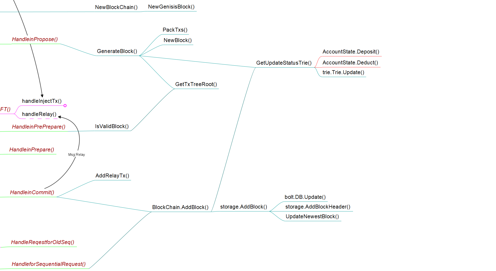

记录底层区块链的基本运行逻辑

## 函数调用关系图



## NewBlockChain()

该函数在节点初始化的时候被调用，区块链数据结构如下：

```go
type BlockChain struct {
	db           ethdb.Database      // 以太坊LevelDB，存储在本地，可以理解为面相磁盘的接口
	triedb       *trie.Database      // 以太坊triedb，用于存储账户状态，triedb建立在db之上，可以理解为面向应用的接口
	ChainConfig  *params.ChainConfig // 区块链配置，包括
    CurrentBlock *core.Block         // 区块链最新区块
	Storage      *storage.Storage    // boltdb，用于存储完整的区块链
	Txpool       *core.TxPool        // 交易池，节点从交易池取交易打包Propose
	PartitionMap map[string]uint64   // 用于状态图划分
	pmlock       sync.RWMutex
}
```

其中区块Block的数据结构如下：

```go
type BlockHeader struct {
	ParentBlockHash []byte     // 前一个块的Hash
	StateRoot       []byte	   // 账户状态根，用于访问账户状态Trie数据库
	TxRoot          []byte	   // 交易根哈希，Merkle树根，用于检验交易。
	Number          uint64     // 编号
	Time            time.Time  // 时间戳
	Miner           uint64     // 矿工，默认为主节点
}
type Block struct {
	Header *BlockHeader
	Body   []*Transaction
	Hash   []byte
}
```

该函数分配必要内存，并尝试从record文件夹中读取已有的区块链数据库(boltDB)，如果没有则调用[NewGenisisBlock()](#NewGenisisBlock())生成一个创世区块，并将创世区块加入到区块链中。

### NewGenisisBlock()

该函数创建一个创世区块，BlockHeader.Number = 0，交易为空，并新建一个存储账户状态的TrieDB

## GenerateBlock()

该函数在Propose阶段被节点调用，生成区块头并从节点的TxPool中取BlockSize个交易放入区块。调用[GetUpdateStatusTrie()](#GetUpdateStatusTrie())更新账户信息树，(BlockEmulator的实现中主节点作为Miner，在Propose阶段就更新StatusTrie，其它节点则在Commit阶段更新StatusTrie。有点小疑问：这是默认Propose一定可以通过么？如果没通过的话StatusTrie如何撤销呢)。随后调用[GetTxTreeRoot()](#GetTxTreeRoot())生成交易的Merkle根Hash，将Block各字段赋值并返回。

### GetUpdateStatusTrie()

在创建区块和将区块上链的时候被调用，该函数实现了交易的过程，即账户状态的更新。Trie树的结构可以参考[Trie树总结-CSDN博客](https://blog.csdn.net/weixin_55851276/article/details/125116521)，TrieDB存储单元是AccountStateHash->AccountState键值对。Trie结构可以快速定位查找一个账户的状态，一个区块链的StateRoot存储在Chain.CurrentBlock.Header.StateRoot，即最新上链的那个区块中。

该函数遍历Block中所有交易，如果Sender账户不存在数据库中，则创建一个账户并给予一定初始balance。比较交易转出数目是否超过账户余额，没有超过则调用[AccountState.Deduct()](./account.md#Deduct())函数扣除余额。随后遍历所有的非跨片交易，即接收者为本分片节点的交易，则调用[AccountState.Deposit()](./account.md#Deposit())函数增加余额，同样如果不存在该账户则新建一个，初始balance初始化为转入余额。最后调用triedb的库函数确认并返回根Hash。

### GetTxTreeRoot()

在创建区块和将区块上链的时候被调用，该函数直接用geth的triedb来实现计算根Hash，比较直接。

## BlockChain.AddBlock()

该函数在Commit阶段被调用，首先检验区块高度是否正确，随后所有非主节点调用[GetUpdateStatusTrie()](#GetUpdateStatusTrie())更新账户信息树(主节点在Propose阶段就已经更新过了)，所有节点调用[Storage.AddBlock()](Storage.AddBlock())将区块最终上链，保存到本地数据库中。

## Storage.AddBlock()

该函数将区块保存到本地boltDB，boltDB也是一个存储键值对的数据库，一个数据库中有许多“桶”(bucket)，在桶中存储键值对。在BlockEmulator的实现中，有blockBucket，blockHeaderBucket和newestBlockHashBucket三个桶，分别存储区块，区块头和最新区块的Hash，桶中键值对的键为值的Hash。

该函数将Block本身保存到blockBucket中，并调用AddBlockHeader()和UpdateNewestBlock()将块头和最新区块存储到对应桶。newestBlockHashBucket的作用是在创建新区块链的时候检查是否已经存在区块链了，而blockHeaderBucket看起来似乎有点多余，作者也没有对它实际有什么应用。
