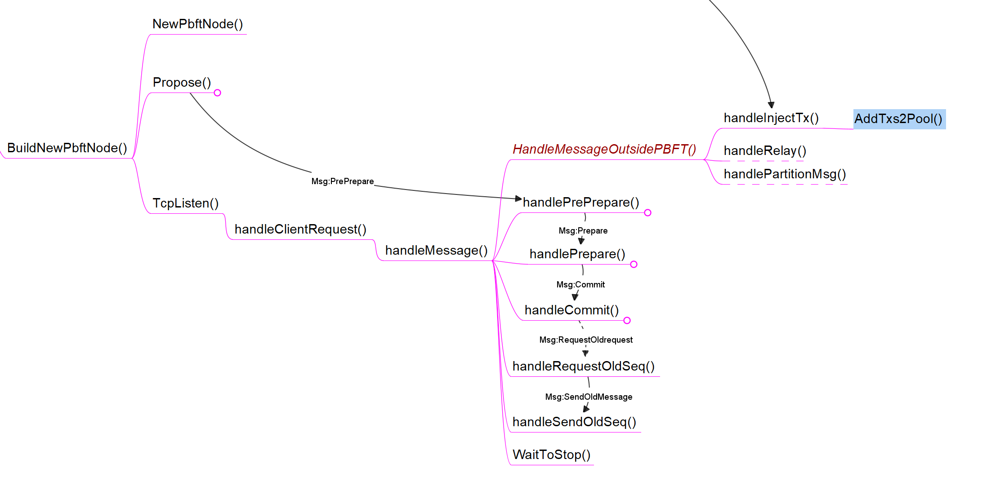

记录PBFT节点的通用运行逻辑，各不同算法的接口处理函数见[PBFT](pbft.md)

## 函数调用关系图



## BuildNewPbftNode()

该函数创建一个新的PBFT节点，每个分片的第一个节点（即nid==0）为主节点，负责接收来自Supervisor发来的交易并进行Propose，随后启动所有节点的TCP监听，所有运行中的节点均参与共识。一个PbftNode结构体如下：

```go	
type PbftConsensusNode struct {
	RunningNode *shard.Node // 本节点标识信息，包括nodeID,shardID,IP
	ShardID     uint64		// 分片ID
	NodeID      uint64      // 节点ID

	// 区块链相关数据结构
	CurChain *chain.BlockChain // 分片所有节点保有同一个链
    db       ethdb.Database    // 以太坊geth中的LevelDB数据库实现，使用mpt树结构(Trie树的变体)，用于存储账户状态，默认存储路径为“./record/ldb/”

	// global config
	pbftChainConfig *params.ChainConfig          // 包括ShardID，NodeID，Shard个数等，有点重复
	ip_nodeTable    map[uint64]map[uint64]string // 所有节点的IP表
	node_nums       uint64                       // 分片节点数，重复
	malicious_nums  uint64                       // f, 3f + 1 = N
	view            uint64                       // 主节点id，一般为0

	// pbft中消息相关
	sequenceID        uint64                          // 消息序列id，也可以看作区块链的高度
	stop              bool                            // 停止信号
	pStop             chan uint64                     // 停止信号通道
	requestPool       map[string]*message.Request     // 消息池
	cntPrepareConfirm map[string]map[*shard.Node]bool // Prepare消息确认节点, [messageHash][Node]bool
	cntCommitConfirm  map[string]map[*shard.Node]bool // Commit消息确认节点, [messageHash][Node]bool
	isCommitBordcast  map[string]bool                 // Commit消息是否已经广播了
    isReply           map[string]bool                 // Reply消息是否发送过了(Reply用于Commit后向主节点回复)
	height2Digest     map[uint64]string               // sequence (block height) -> request, fast read

	// 互斥锁相关
	sequenceLock sync.Mutex // 消息序列锁
	lock         sync.Mutex // 节点锁
	askForLock   sync.Mutex // 请求其他节点发送块的锁
	stopLock     sync.Mutex // 停止信号锁

	// 其他分片的消息ID，用于同步
	seqIDMap   map[uint64]uint64
	seqMapLock sync.Mutex

	// 日志相关
	pl *pbft_log.PbftLog
    
	// TCP相关
	tcpln       net.Listener
	tcpPoolLock sync.Mutex

    // PBFT消息处理接口(Propose,Preprepare, Prepare, Commit)
	ihm PbftInsideExtraHandleMod

    // PBFT之外的消息处理接口(如Monoxide中的Relay消息)
	ohm PbftOutsideHandleMod
}
```


### NewPbftNode()

根据参数新建一个节点，分配结构体中需要的内存，各参数可通过params包静态修改。对接口进行赋值，主要是以下两个接口。并调用[NewBlockChain()](./blockchain.md#NewBlockChain())：

+ PBFT消息处理接口，包含Propose、PrePrepare、Prepare、Commit四个步骤的消息处理

```go
type PbftInsideExtraHandleMod interface {
	HandleinPropose() (bool, *message.Request)
	HandleinPrePrepare(*message.PrePrepare) bool
	HandleinPrepare(*message.Prepare) bool
	HandleinCommit(*message.Commit) bool
    HandleReqestforOldSeq(*message.RequestOldMessage) bool    // 暂时没啥用
	HandleforSequentialRequest(*message.SendOldMessage) bool  // 处理接受到的新块的信息，将块整合到本地链中。
}
```

+ PBFT之外的消息处理接口，如通用的处理来自Supervisor注入交易消息的函数[handleInjectTx()](#handleInjectTx())，或者Monoxide中特有的处理Relay消息的函数等。

```go
type PbftOutsideHandleMod interface {
	HandleMessageOutsidePBFT(message.MessageType, []byte) bool
}
```

  

#### initConfig()

该函数设置区块链参数，包括：

+ 初始化节点IP表(在本地运行，也可以说是端口表)

+ 分片数

+ 片内节点数，目前实现的片内节点数各分片是一样的

+ 链参数结构体如下，其中ChainID在目前的实现中等效于ShardID，作用不明。
  

```go
type ChainConfig struct {
    ChainID        uint64 // Same as ShardID Temporarily
    NodeID         uint64
    ShardID        uint64
    Nodes_perShard uint64
    ShardNums      uint64
    BlockSize      uint64
    BlockInterval  uint64 // The interval between two blocks
    InjectSpeed    uint64 // The speed supervisor deliver transactions to shards

    // used in transaction relaying, useless in brokerchain mechanism
    MaxRelayBlockSize uint64
}
```

### Propose()

该函数调用由分片中的主节点调用，主节点同时也是PBFT中的Client，负责提出和处理Propose。该函数调用接口函数[HandleinPropose()](./pbft#HandleinPropose())来生成新的块并生成上链的Request，随后生成PrePrepare消息并在分片内广播。其中PrePrepare消息结构体如下，

```go
type Request struct {
	RequestType RequestType // 暂时只有blockRequest一种...可
	Msg         RawMessage  // 在此处是一个block
	ReqTime     time.Time   // 时间戳
}

type PrePrepare struct {
	RequestMsg *Request
    Digest     []byte   // 摘要，通过Sha256算法生成
	SeqID      uint64   // 本节点SeqID
}
```


### TcpListen()

所有的节点均开启TCP监听，接收到消息后调用[handleClientRequest()](#handleClientRequest())启动协程完成消息处理，

#### handleClientRequest()

以行为单位读取消息中的内容，并调用handleMessage()根据消息不同类型对消息进行处理，包括除了Propose消息的PBFT共识消息和PBFT外的消息；如果接受到终止信号则停止处理并返回。中间还有一些简单的过渡函数，这里直接跳过到消息处理函数

##### handleInjectTx()

该函数将从Supervisor接收到的交易数据添加到当前的BlockChain.Txpool中

##### handlePrePrepare()

该函数检验收到的PrePrepare消息的摘要，并比较消息的SeqID与本节点的SequenceID，如本节点sequenceID较小，则将请求放入requestPool中并拒绝PrePerpare。否则，调用接口函数[HandleinPrePrepare()](./pbft#HandleinPrePrepare())判断PrePrepare是否通过，如通过则生成Prepare消息并在本分片中广播。Prepare消息结构体如下

```go
type Prepare struct {
	Digest     []byte      // 同PrePrepareMsg的摘要
	SeqID      uint64      // 同PrePrepareMsg的SeqID
	SenderNode *shard.Node // 标识本条消息的发送节点
}
```

##### handlePrepare()

该函数检验收到的Prepare消息的摘要是否在requestPool库中，并比较消息的SeqID与本节点的SequenceID，如本节点sequenceID较小则拒绝Prepare。否则，调用set2DMap()函数，将本地cntPrepareConfirm数组对应节点设为True以记录通过Prepare的节点个数，这里使用map而不是计数器应是为了防止收到同一个节点的多次Prepare，不过实际上在BlockEmulator实现中并没有重发的机制，所以使用计数器应该也是可以的？当通过Prepare个数高于2f的时候生成Commit消息并广播到本分片，接收到更多的Prepare不重复广播。

```go
type Commit struct {
	Digest     []byte      // 同PrepareMsg的摘要
	SeqID      uint64      // 同PrepareMsg的SeqID
	SenderNode *shard.Node // 标识本条消息的发送节点
}
```

##### handleCommit()

节点统计收到Commit消息的数量超过2f后进行Commit，消息数量同样通过MsgDigest->Node映射来统计。调用接口函数[HandleinCommit()](./pbft#HandleinCommit())将块上链或进行跨分片交易操作。如该节点中没有对应的request记录，则需要从主节点获取，构造请求消息，其结构体如下，并发送给主节点。

```go
type RequestOldMessage struct {
	SeqStartHeight uint64      // p.sequenceID + 1，即从这个高度之后的request都需要发送
	SeqEndHeight   uint64      // msg.SeqID，发送到需要的那个request为止
	ServerNode     *shard.Node // 主节点信息
	SenderNode     *shard.Node // 请求节点信息
}
```

##### handleRequestOldSeq()

主节点收到节点请求request记录的消息后调用该函数进行处理，根据发送请求消息中的request序列高度将所有request写入SendOldMessage消息中，并回送给请求节点。SendOldMessage结构体如下，

```go
type SendOldMessage struct {
	SeqStartHeight uint64      // 同RequestOldMessage
	SeqEndHeight   uint64      // 同RequestOldMessage
	OldRequest     []*Request  // 请求节点缺失的的requests
	SenderNode     *shard.Node // 主节点信息
}
```

##### handleRequestOldSeq()

请求节点收到主节点回送的消息后进行处理，调用接口函数[HandleforSequentialRequest()](./pbft#HandleforSequentialRequest())将回送的request进行上链，即完成 commit步骤，随后将所有request加入本节点requestPool中。随即继续处理下一个PrePrepare消息，即可能的在[handlePrePrepare()](#handlePrePrepare())中由于p.sequenceID < ppmsg.SeqID被拒绝通过的PrePrepare。
