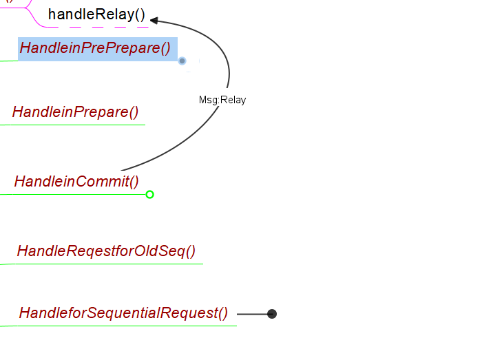

记录PBFT相关的接口函数的运行逻辑，以Monoxide为例

## 函数调用关系图



## HandleinPropose()

主节点循环调用该接口函数，该函数调用[GenerateBlock()](./blockchian.md#GenerateBlock())将交易池中的交易打包生成新的区块，并生成request消息，即PBFT共识请求，其结构体如下

```go
type Request struct {
	RequestType RequestType  // 暂时只有block request一种
	Msg         RawMessage   // 即一个block
	ReqTime     time.Time    // request time
}
```


## HandleinPrePrepare()

节点收到PrePrepare消息后会调用该接口检验PrePrepare的有效性。该函数调用[IsValidBlock()](./blockchian.md#IsValidBlock())检验PrePrepare中的block是否有效，如有效则将该块加到节点的requestPool中(这里代码重复了)

## HandleinPrePrepare()

在Monoxide的实现中该函数暂时没用

## HandleinCommit()

节点收到足够的commit消息后会调用该接口将区块上链。该函数调用[AddBlock()](./blockchian.md#AddBlock())将区块上链。对于主节点，根据Monoxide的方法，还需要遍历选出跨分片的交易，并生成对应的Realy消息。Relay消息结构体如下，构造完成后发送给对应分片。

```go
type Relay struct {
	Txs           []*core.Transaction
	SenderShardID uint64
	SenderSeq     uint64  // 本节点的sequenceID
}
```

最后主节点还需要向Supervisor发送生成的区块信息，以使Supervisor进一步分析。区块信息消息结构体如下，作者将各分片方案的消息结构体放在了同一个结构体中：

```go
type BlockInfoMsg struct {
	BlockBodyLength int
	ExcutedTxs      []*core.Transaction // 已执行Txs，即片内交易
	Epoch           int                 // 该字段暂时没实际应用，设为0

	ProposeTime   time.Time // RequestTime
	CommitTime    time.Time // time.Now()
	SenderShardID uint64

	// Monoxide
	Relay1TxNum uint64              // 跨片交易数
	Relay1Txs   []*core.Transaction // 跨片交易

	// BrokerChain
	Broker1TxNum uint64              // the number of broker 1
	Broker1Txs   []*core.Transaction // cross transactions at first time by broker
	Broker2TxNum uint64              // the number of broker 2
	Broker2Txs   []*core.Transaction // cross transactions at second time by broker
}
```

## HandleReqestforOldSeq（）

保留接口

## HandleforSequentialRequest()

commit过程中发现request缺失的节点会向主节点请求缺失request，收到来自主节点的回复后会调用该接口继续commit的过程。该函数将收到的所有request中的区块依次调用[AddBlock()](./blockchian.md#AddBlock())上链。

## HandleRelay()

这个其实和pbft无关，但因为它也是接口我就放一起了。只有分片的主节点会收到Relay消息，该函数将所有Txs添加到本接待你区块链的TxPool中等待和其它交易一起打包上链。
