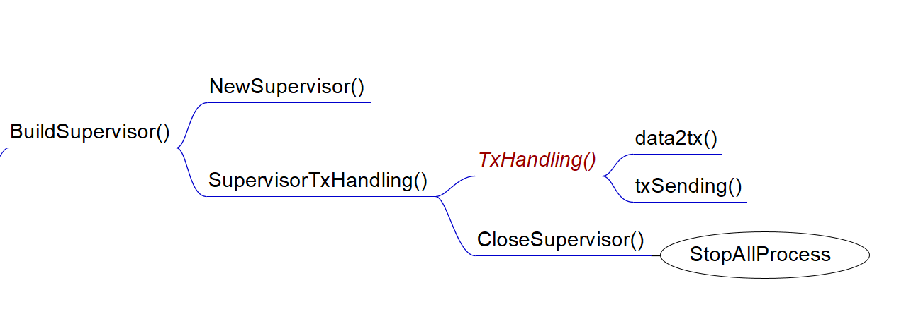

记录Supervisor的运行逻辑，具体的

## 函数调用关系图



## BuildSupervisor()

该函数创建一个新的Supervisor，仅有一个Supervisor节点，负责处理交易数据集并发送给各分片，并运行监控进程，进行区块链进行测试，在运行完成后回收各节点进程等。该函数调用[NewSupervisor()](#NewSupervisor())创建新的Supervisor并启动[SupervisorTxHandling()](#SupervisorTxHandling())协程处理交易数据集。TcpListen()监听各节点返回的有关性能的信息并记录实验结果。一个Supervisor结构体如下：

```go	
type Supervisor struct {
	// 基本信息
	IPaddr       string                        // Supervisor的IP
	ChainConfig  *params.ChainConfig           // 区块链配置，包括节点id，分片id等
 	Ip_nodeTable map[uint64]map[uint64]string  // 所有节点的IP表

	// TCP控制相关
	listenStop bool
	tcpLn      net.Listener
	tcpLock    sync.Mutex
	// 日志结构体
	sl *supervisor_log.SupervisorLog

	// 控制结构体，将停止信息发送给各个节点以结束所有进程
	Ss *signal.StopSignal

	// supervisor和committee模块
	comMod committee.CommitteeModule

	// 测试相关模块
	testMeasureMods []measure.MeasureModule
}
```


### NewSupervisor()

根据参数新建一个Supervisor，参数通过params包静态修改。并对接口进行赋值，主要是以下两个接口：

+ Committee接口，基本作用是将交易数据集打包并发给各个分片，在CLPA算法中也负责节点重新分配分片的计算。

```go
type CommitteeModule interface {
	AdjustByBlockInfos(*message.BlockInfoMsg)   // 用于动态分配节点
	TxHandling()                				// 处理交易数据集
	HandleOtherMessage([]byte)  				// 预留接口，暂时没用
}
```

+ 测试模块接口，负责做区块链性能测试(ToDo)

```go
type MeasureModule interface {
  UpdateMeasureRecord(*message.BlockInfoMsg)
  HandleExtraMessage([]byte)
  OutputMetricName() string
  OutputRecord() ([]float64, float64)
}
```

  

#### initConfig()

该函数设置区块链参数，包括：

+ 初始化节点IP表(在本地运行，也可以说是端口表)

+ 分片数

+ 片内节点数，目前实现的片内节点数各分片是一样的

+ 链参数结构体如下，其中ChainID在目前的实现中等效于ShardID，作用不明。
  
```go
type ChainConfig struct {
    ChainID        uint64 // Same as ShardID Temporarily
    NodeID         uint64
    ShardID        uint64
    Nodes_perShard uint64
    ShardNums      uint64
    BlockSize      uint64
    BlockInterval  uint64 // The interval between two blocks
    InjectSpeed    uint64 // The speed supervisor deliver transactions to shards

    // used in transaction relaying, useless in brokerchain mechanism
    MaxRelayBlockSize uint64
}
```

### SupervisorTxHandling()

该函数调用[TxHandling()](#TxHandling())处理交易数据集，在等待所有交易处理完成后向所有节点发送终止运行信号，并停止Supervisor运行

#### TxHandling()

该函数从csv文件中读取交易数据集，文件路径可通过params包修改。调用[data2tx()](data2tx())将数据转化为交易，并打包为list，在积累到batchDataNum时调用[txSending()](#txSending())发送给各个分片。

##### data2tx()

该函数将读取的一行csv内容转化为交易。交易数据集取自[XBlock](https://xblock.pro/#/dataset/14)，为以太坊链上交易，取非智能合约的交易，保留[from, to, value]三个字段(原数据集一共18个字段，其余大多与以太坊的gas或者智能合约相关)，并调用NewTransaction()(ToDo)生成新的交易结构体。Transaction相关的更详细的内容在(ToDo)

##### txSending()

该函数将tx分配给不同的分片，策略是取sender的地址后8位，转化为整数并模params.ShardNum。每处理params.InjectSpeed个交易后便发送一次，将每个分片的交易发送到该分片的主节点，即rthm.IpNodeTable\[sid\]\[0\]

### TcpListen()

(ToDo)
